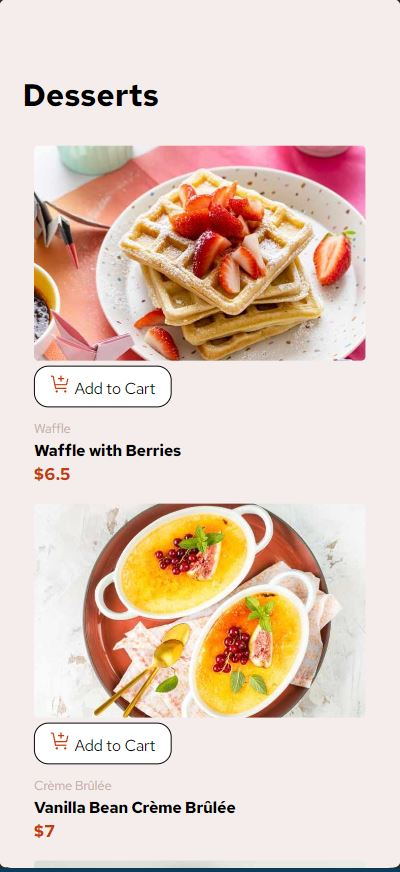

# Frontend Mentor - Product list with cart solution


## Table of contents

- [Overview](#overview)
  - [The challenge](#the-challenge)
  - [Screenshot](#screenshot)
  - [Links](#links)
- [My process](#my-process)
  - [Built with](#built-with)
  - [What I learned](#what-i-learned)
  - [Continued development](#continued-development)
  - [Useful resources](#useful-resources)
- [Author](#author)
- [Acknowledgments](#acknowledgments)


## Overview

The challenge is to build out A  product list project that includes a functional cart through a provided data for the products in a local `data.json` file. So it is being used to populate the UI dynamically if you choose.

### The challenge

Users should be able to:

- Add items to the cart and remove them
- Increase the number of items in the cart
- See an order confirmation modal when they click "Confirm Order"
- Reset their selections when they click "Start New Order"
- View the optimal layout for the interface depending on their device's screen size
- See hover and focus states for all interactive elements on the page

### Screenshot




### Links

- Solution URL: [ solution URL here](https://your-solution-url.com)
- Live Site URL: [ live site URL here](https://your-live-site-url.com)

## My process

### Built with

- Semantic HTML5 markup
- CSS custom properties
- Flexbox
- ES6 JavaScript


### What I learned

I've learned managing data in JSON file, depending on it , Dynamically creating elements in DOM.
I've learned controlling every item in the DOM and customizing it based on my needs.

Not to Forget getting multiple images from JSON file for different aspect and how to handle it.

when u assign src not srcset , it will be assigned once without being changed.

```js-1
const SizeImage=()=>{
   const imgElement = document.createElement('img');
    imgElement.classList.add('thumbnail_card');
    imgElement.setAttribute('alt', 'main_image');
    imgElement.setAttribute('srcset', `
      ${element.image.mobile} 792w,
      ${element.image.tablet} 1024w,
      ${element.image.desktop} 1200w
    `);
    imgElement.setAttribute('sizes', `
      (max-width: 792px) 100vw, 
      (max-width: 1200px) 1024px, 
      1200px
    `);
    imgElement.setAttribute('src', element.image.desktop);
}
```

```js-2
const proudOfThisFunc = () => {
   const cartElement = document.querySelector('.cartContent');
  const OrderNumber = document.querySelector('.your-cart');
  cartElement.innerHTML = "";
  let TotalOrder = 0;
  let count = 0;

  // Loop within cart
  for (const element in cart) {
    const cartItem = cart[element];
    let priceOfElement = cartItem.Item.price * cartItem.quantity;
    const contentDiv = document.createElement('div');
    contentDiv.classList.add('cart-item');
    TotalOrder += priceOfElement;
    count++;
    contentDiv.innerHTML = `
      <h5>${cartItem.Item.name}</h5>
      <span class="span-Qt">${cartItem.quantity}x</span>
      <span>@ ${cartItem.Item.price.toFixed(2)}</span>
      <span class="span-Pr">${priceOfElement.toFixed(2)}</span>
      
    `;
}
```


### Continued development

- I'll add it to bigger Restaurant Platform and just modify JSON file.
- Configure few tweaks to make it decrease the number of quantity within button.


### Useful resources

- [Example resource 1](https://www.w3schools.com) - This helped me know more function in javascript . I really liked this pattern and will use it going forward.
- [Example resource 2](https://www.stackoverflow.com) - This is an amazing form for different solution which helped me finally understand more the DOM . I'd recommend it to anyone still learning about this .


## Author

- Website - akchouche Mouhamed Amine(https://port-4391f.web.app/)
- Frontend Mentor - [@Mouhamed-Amine](https://www.frontendmentor.io/profile/yourusername)
- LinkedIn - (https://www.linkedin.com/in/mouhamed-amine-531036187/)


## Acknowledgments

Special Thanks to experts behind every resource i've used and for the authors of frontend Mentor who gave me this challenge to improve my skills.

